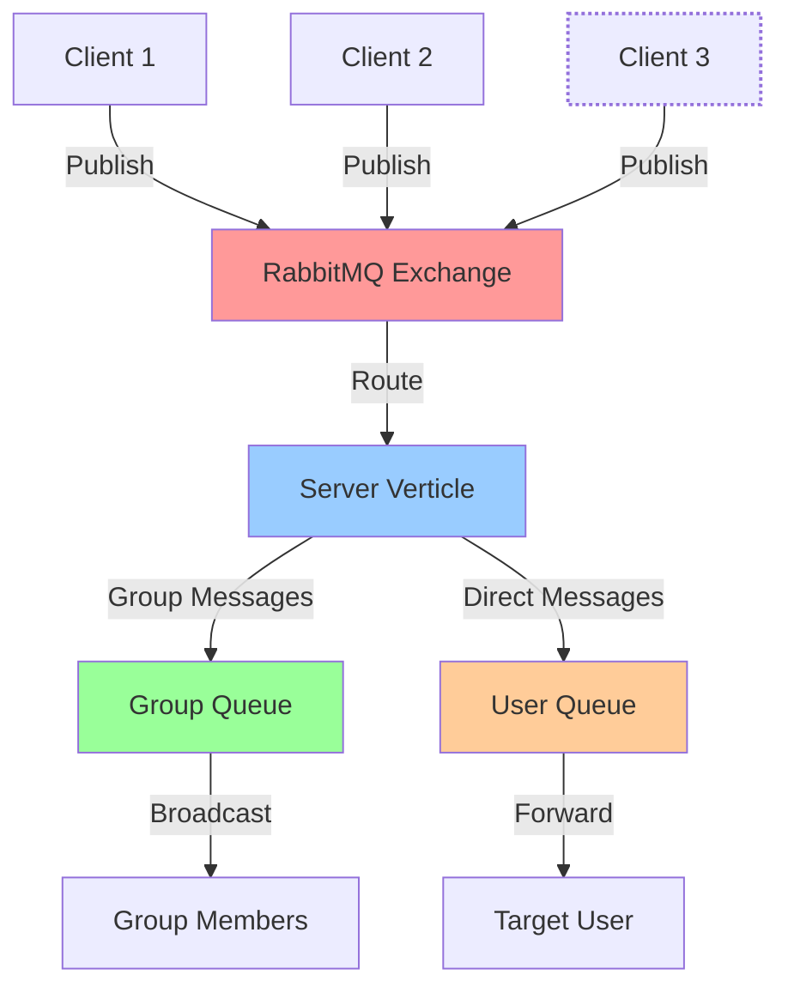
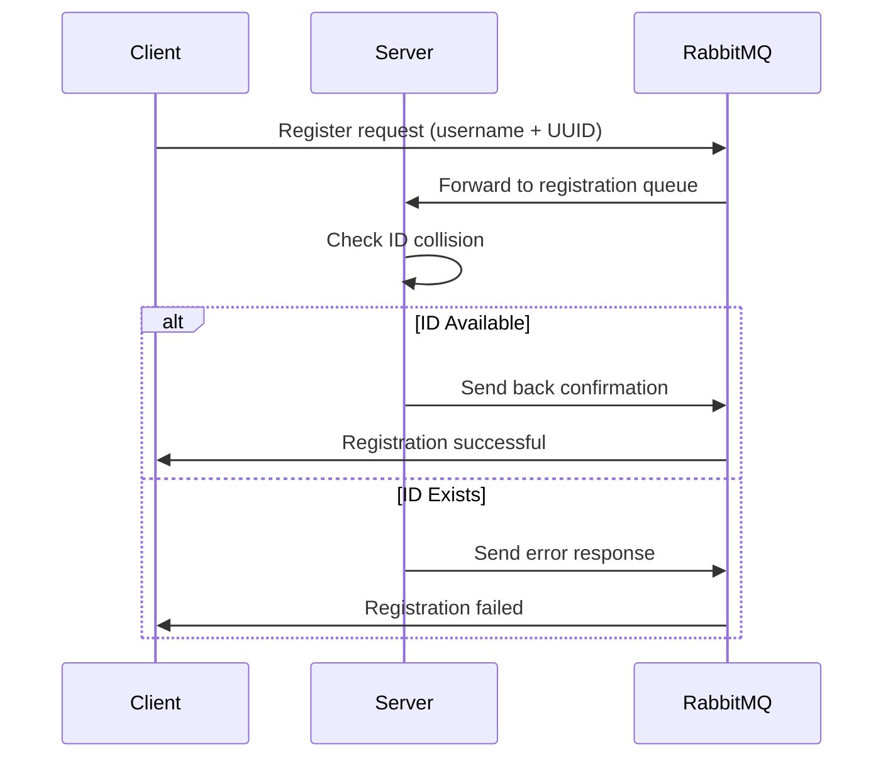
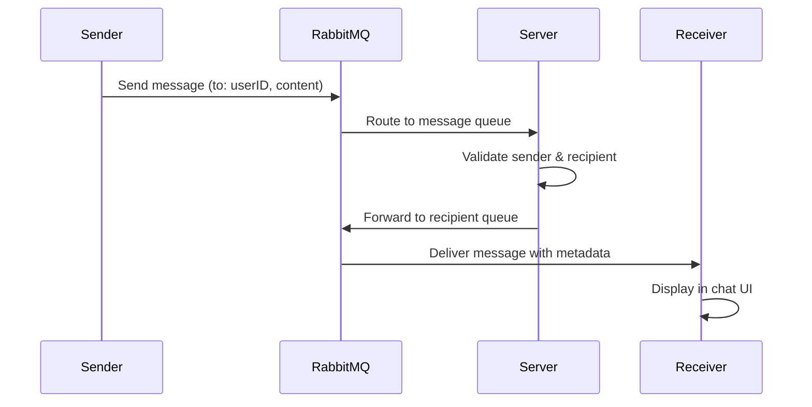
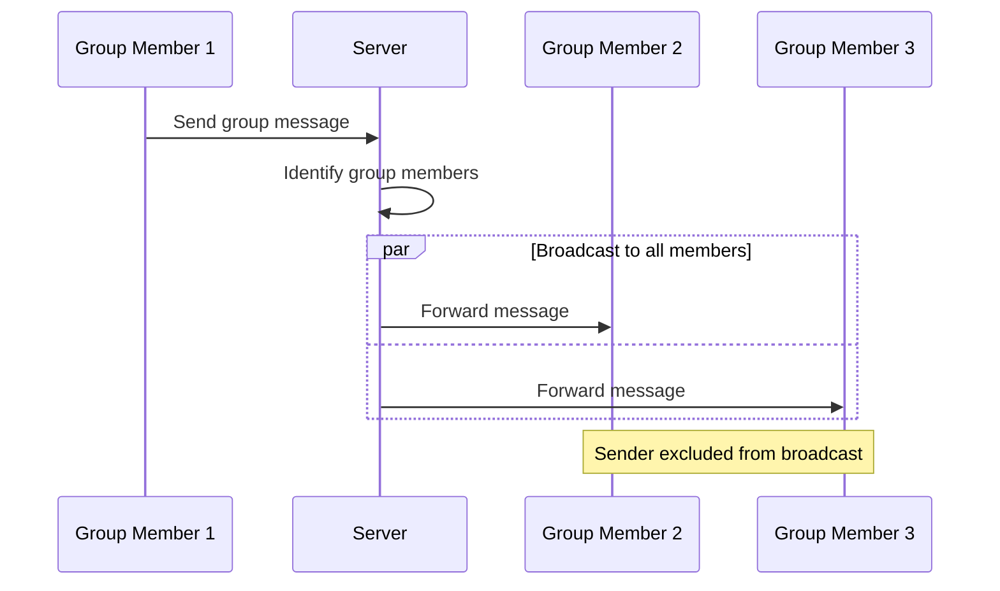

<h1 align="center">Distributed Chat System</h1>


<p align="center">


</p>

## Overview

This project implements a comprehensive distributed chat system using:
- **Vert.x** for event-driven architecture and async processing
- **RabbitMQ** as the message broker for reliable message delivery
- **JavaFX** for rich desktop client UI with modern interface

The system supports:
- ✅ Real-time text messaging (1-to-1 and group chat)
- ✅ File sharing with preview and download capabilities
- ✅ Image sharing with inline preview and full-screen view
- ✅ Group chat management (create, join, leave groups)
- ✅ Message editing functionality
- ✅ Multiple concurrent users with unique ID system
- ✅ User registration with UUID generation
- ✅ File type detection with appropriate icons

## ️ Architecture


### Key Components:

1. **Server Verticle** (`ServerVerticle.kt`):
   - Manages user registration with collision detection
   - Routes messages between users and groups
   - Handles group operations (create, join, leave)
   - Manages message editing and history
   - Uses dedicated RabbitMQ queues for each operation type

2. **Client Verticle** (`ClientVerticle.kt`):
   - Manages connection to RabbitMQ broker
   - Handles real-time message receiving
   - Processes different message types (text, file, image, group operations)
   - Maintains user session and authentication state

3. **Chat UI** (`ChatUI.kt`):
   - Modern JavaFX interface with tabbed layout
   - File/Image preview before sending
   - Group management dialog
   - Message editing capabilities
   - Drag-and-drop file support
   - Responsive design with proper layouts

4. **Group Manager** (`Group.kt`):
   - Complete group chat functionality
   - Create groups with unique IDs
   - Join/leave group operations
   - Member management
   - Group message broadcasting

## Features

### User Registration & Authentication


### Message Flow (Direct Chat)


### Group Chat Flow


## Setup & Usage

### Prerequisites
- **Java 11+** (with JavaFX support)
- **RabbitMQ Server** (running on default port 5672)
- **Gradle** or **Maven** for dependency management

### Configuration
```bash
# Set RabbitMQ host (optional, defaults to localhost)
export RABBITMQ_HOST=your_rabbitmq_host

# For production deployment
export RABBITMQ_HOST=production-rabbitmq-server.com
```

### Running the System

1. **Start RabbitMQ Server**:
```bash
# Using Docker
docker run -d --hostname rabbitmq --name rabbitmq-server -p 5672:5672 -p 15672:15672 rabbitmq:3-management

# Or using local installation
sudo systemctl start rabbitmq-server
```

2. **Launch the Application**:
```kotlin
// Main application entry point
fun main() {
    Application.launch(ChatApp::class.java)
}
```

The system automatically:
- Deploys server verticle
- Creates multiple client instances for testing
- Sets up all necessary RabbitMQ queues and exchanges

## Message Types & Protocols

| Message Type | Route Key | JSON Format | Description |
|--------------|-----------|-------------|-------------|
| **Registration** | `register` | `{username, uuid}` | User registration with custom/generated ID |
| **Text Message** | `message` | `{toId, message, messageId}` | Direct or group text messages |
| **File Sharing** | `file` | `{toId, file, data(base64)}` | File attachments with base64 encoding |
| **Image Sharing** | `image` | `{toId, image(base64)}` | Image files with preview support |
| **Message Edit** | `edit` | `{messageId, newContent}` | Edit existing messages |
| **Group Create** | `create_group` | `{groupId, groupName, createdBy}` | Create new group chats |
| **Group Join** | `join_group` | `{groupId}` | Join existing groups |
| **Group Leave** | `leave_group` | `{groupId}` | Leave group chats |

## Advanced Features

### File & Image Handling
- **Preview System**: Files and images can be previewed before sending
- **Type Detection**: Automatic file type detection with appropriate icons (📄 PDF, 📝 DOC, 📊 XLS, etc.)
- **Download Support**: Recipients can download shared files to local storage
- **Image Viewer**: Full-screen image viewing with copy-to-clipboard functionality

### Group Chat Management
- **Dynamic Groups**: Create groups with custom names and auto-generated IDs
- **Member Management**: Real-time join/leave notifications
- **Group Persistence**: Groups are maintained on server until last member leaves
- **Broadcast Messaging**: Efficient message distribution to all group members

### Message Features
- **Edit Capability**: Users can edit their own messages post-send
- **Message History**: Server maintains message history for edited content
- **Delivery Confirmation**: Visual feedback for message delivery status
- **Timestamp Support**: All messages include server-side timestamps

### UI/UX Enhancements
- **Modern Interface**: Clean JavaFX design with intuitive controls
- **Real-time Updates**: Instant message display with smooth scrolling
- **User Information**: Display current user info with copyable UUID
- **Notification System**: Toast notifications for system events
- **Responsive Layout**: Adaptive UI that scales with window size

## Technical Implementation Details

### Queue Management
- **Dynamic Queue Creation**: Queues created on-demand for new users
- **Queue Cleanup**: Automatic cleanup of unused queues
- **Message Persistence**: RabbitMQ durability settings for message reliability
- **Error Handling**: Comprehensive error handling for connection failures

### Concurrency & Threading
- **Thread-Safe Operations**: ConcurrentHashMap for user and group storage
- **JavaFX Threading**: Proper Platform.runLater() usage for UI updates
- **Async Processing**: Vert.x event loop for non-blocking operations

### Security Considerations
- **UUID-based Authentication**: Unique user identification system
- **Message Validation**: Server-side validation of all incoming messages
- **Access Control**: Users can only edit their own messages
- **Group Security**: Only group members receive group messages

## Error Handling

The system includes comprehensive error handling for:
- **Connection Failures**: Automatic reconnection attempts to RabbitMQ
- **Invalid Messages**: Malformed JSON or missing required fields
- **User Conflicts**: Duplicate UUID registration prevention
- **File Transfer Errors**: Graceful handling of corrupted or oversized files
- **UI Exceptions**: Proper error display in JavaFX interface

## Future Enhancements

Potential improvements and features:
- [ ] **Message Encryption**: End-to-end encryption for secure communication
- [ ] **Voice Messages**: Audio recording and playback support
- [ ] **User Presence**: Online/offline status indicators
- [ ] **Message Reactions**: Emoji reactions to messages
- [ ] **File Streaming**: Large file transfer with progress indicators
- [ ] **Database Integration**: Persistent message storage with database
- [ ] **Web Client**: Browser-based client using WebSocket connections
- [ ] **Mobile Support**: Cross-platform mobile applications