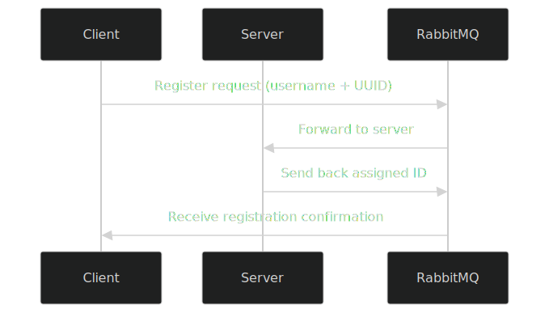
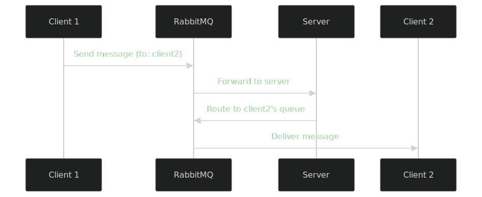

# Distributed Chat System

## 📝 Overview
This project implements a distributed chat system using:
- **Vert.x** for event-driven architecture
- **RabbitMQ** as the message broker
- **JavaFX** for the client UI

The system supports:
- Real-time text messaging
- File sharing
- Image sharing
- Multiple concurrent users

## 🏗️ Architecture



### Key Components:
1. **Server Verticle**:
   - Manages user registration
   - Routes messages between clients
   - Uses RabbitMQ queues for communication

2. **Client Verticle**:
   - Provides chat UI (JavaFX)
   - Handles message sending/receiving
   - Manages file/image transfers

3. **RabbitMQ**:
   - Acts as message broker
   - Uses direct exchange for routing
   - Dedicated queues for each client

## 🚀 Features

### User Registration


### Message Flow

## 🛠️ Setup & Usage

### Prerequisites
- Java 11+
- RabbitMQ server
- Gradle/Maven

### Configuration
```bash
# Set RabbitMQ host (default: localhost)
export RABBITMQ_HOST=your_rabbitmq_host
```

### Running the System
1. Start the server:
```kotlin
vertx.deployVerticle(ServerVerticle())
```

2. Launch clients:
```kotlin
val client1 = ClientVerticle("Client-1")
vertx.deployVerticle(client1)

val client2 = ClientVerticle("Client-2") 
vertx.deployVerticle(client2)
```

## 📊 Message Types

| Type  | Format                          | Description        |
|-------|----------------------------------|--------------------|
| Text  | JSON: `{toId, message}`          | Basic text messages |
| File  | JSON: `{toId, file, data(base64)}` | File attachments    |
| Image | JSON: `{toId, image(base64)}`    | Image sharing       |

## 🌟 Advanced Features

- **Message Persistence**: RabbitMQ queues store undelivered messages
- **Error Handling**: Duplicate ID detection during registration
- **File Previews**: Client-side preview before sending files/images
- **Responsive UI**: JavaFX interface with clean layout