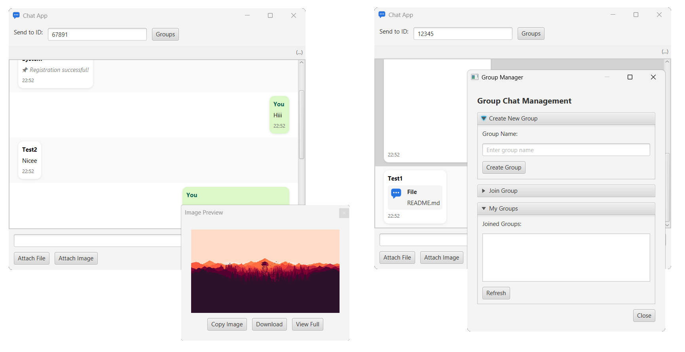
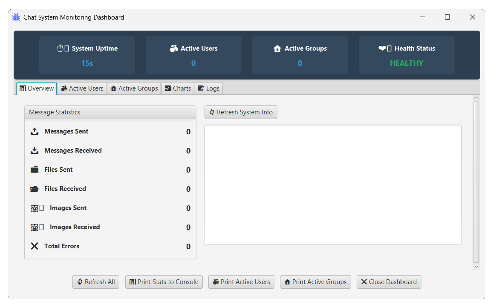
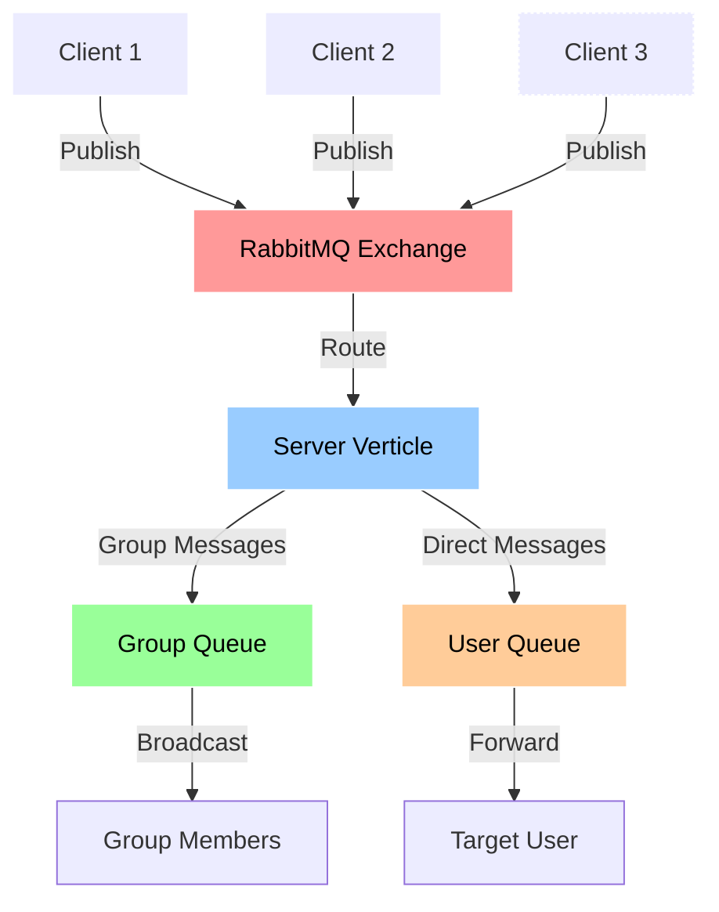
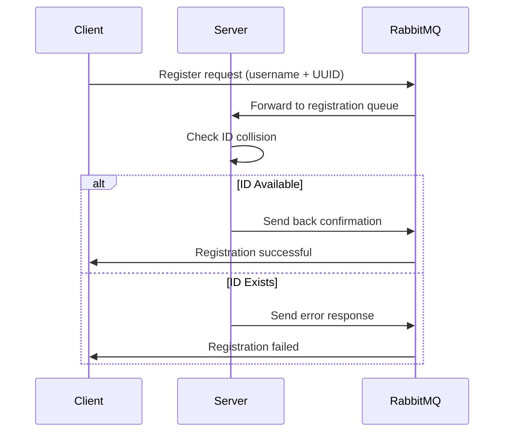
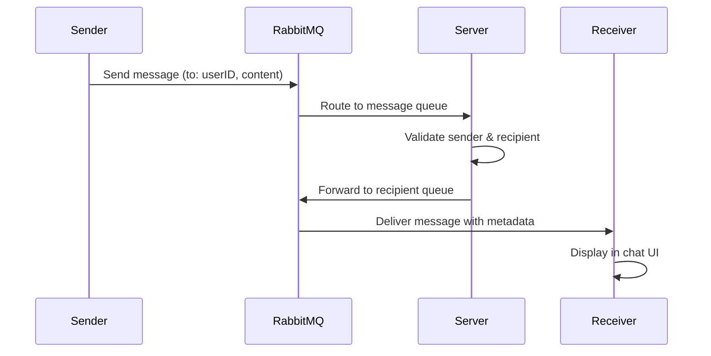
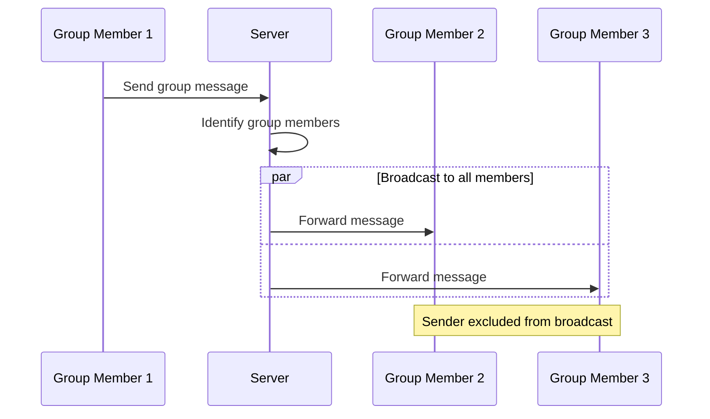

<a id="readme-top"></a>

<p align="center">
<a href="https://github.com/Phenikaa-team/ChatAsyncProcessor">
    
</a>
</p>

<h1 align="center">Distributed Chat System </h1>

<p align="center">


</p>

---

## Overview

This project implements a comprehensive distributed chat system using:
- **Vert.x** for event-driven architecture and async processing
- **RabbitMQ** as the message broker for reliable message delivery
- **JavaFX** for rich desktop client UI with modern interface

The system supports:
- ✅ Real-time text messaging (1-to-1 and group chat)
- ✅ File sharing with preview and download capabilities
- ✅ Image sharing with inline preview and full-screen view
- ✅ Group chat management (create, join, leave groups)
- ✅ Message editing functionality
- ✅ Multiple concurrent users with unique ID system
- ✅ User registration with UUID generation
- ✅ File type detection with appropriate icons
- ✅ Monitoring / Logging

UI:
- <details>
    <summary>Chat panel </summary>
    
 </details>

- <details>
    <summary>Monitor dashboard </summary>
    
  </details>

---

## ️ Architecture


---

### Key Components:

1. **Server Verticle** (`ServerVerticle.kt`):
   - Manages user registration with collision detection
   - Routes messages between users and groups
   - Handles group operations (create, join, leave)
   - Manages message editing and history
   - Uses dedicated RabbitMQ queues for each operation type

2. **Client Verticle** (`ClientVerticle.kt`):
   - Manages connection to RabbitMQ broker
   - Handles real-time message receiving
   - Processes different message types (text, file, image, group operations)
   - Maintains user session and authentication state

3. **Chat UI** (`ChatUI.kt`):
   - Modern JavaFX interface with tabbed layout
   - File/Image preview before sending
   - Group management dialog
   - Message editing capabilities
   - Drag-and-drop file support
   - Responsive design with proper layouts

4. **Group Manager** (`Group.kt`):
   - Complete group chat functionality
   - Create groups with unique IDs
   - Join/leave group operations
   - Member management
   - Group message broadcasting

---

## Features

### User Registration & Authentication


### Message Flow (Direct Chat)


### Group Chat Flow


---

## Setup & Usage

### Prerequisites
- **Java 11+** (with JavaFX support)
- **RabbitMQ Server** (running on default port 5672)
- **Gradle** or **Maven** for dependency management

### Configuration
```bash
# Set RabbitMQ host (optional, defaults to localhost)
export RABBITMQ_HOST=your_rabbitmq_host

# For production deployment
export RABBITMQ_HOST=production-rabbitmq-server.com
```

### Running the System

1. **Start RabbitMQ Server**:
```bash
# Using Docker
docker run -d --hostname rabbitmq --name rabbitmq-server -p 5672:5672 -p 15672:15672 rabbitmq:3-management

# Or using local installation
sudo systemctl start rabbitmq-server
```

2. **Launch the Application**:
```kotlin
// Main application entry point
fun main() {
    Application.launch(ChatApp::class.java)
}
```

The system automatically:
- Deploys server verticle
- Creates multiple client instances for testing
- Sets up all necessary RabbitMQ queues and exchanges

---

## Message Types & Protocols

| Message Type | Route Key | JSON Format | Description |
|--------------|-----------|-------------|-------------|
| **Registration** | `register` | `{username, uuid}` | User registration with custom/generated ID |
| **Text Message** | `message` | `{toId, message, messageId}` | Direct or group text messages |
| **File Sharing** | `file` | `{toId, file, data(base64)}` | File attachments with base64 encoding |
| **Image Sharing** | `image` | `{toId, image(base64)}` | Image files with preview support |
| **Message Edit** | `edit` | `{messageId, newContent}` | Edit existing messages |
| **Group Create** | `create_group` | `{groupId, groupName, createdBy}` | Create new group chats |
| **Group Join** | `join_group` | `{groupId}` | Join existing groups |
| **Group Leave** | `leave_group` | `{groupId}` | Leave group chats |

---

## Advanced Features

### File & Image Handling

* **Preview**: View files and images before sending
* **Type Detection**: Automatically detect file types with icons (📄 PDF, 📝 DOC, 📊 XLS, etc.)
* **Downloadable**: Recipients can download shared files
* **Image Viewer**: Full-screen image viewing with copy-to-clipboard support

### Group Chat Management

* **Dynamic Groups**: Create groups with custom names and auto-generated IDs
* **Join/Leave Events**: Real-time notifications for member activity
* **Group Persistence**: Groups remain active until the last member leaves
* **Broadcast Messaging**: Efficiently send messages to all group members

### Message Features

* **Edit**: Users can edit their own sent messages
* **History**: Message history and edits are tracked
* **Delivery Status**: Visual indicators for message delivery
* **Timestamps**: Server-generated timestamps for all messages

### UI/UX Enhancements

* **Modern UI**: Clean JavaFX interface with intuitive controls
* **Live Updates**: Instant message rendering with smooth scrolling
* **User Info**: Display user UUID with copy functionality
* **Notifications**: Toast notifications for system events
* **Responsive Layout**: UI adapts to window size dynamically

---

## Technical Implementation

### Queue Management

* **Dynamic Creation**: Queues created on demand for new users
* **Auto Cleanup**: Automatically remove unused queues
* **Durability**: RabbitMQ durability ensures message reliability
* **Error Handling**: Robust error handling for connection failures

### Concurrency & Threading

* **Thread-Safe**: Use of `ConcurrentHashMap` for user/group tracking
* **UI Threading**: Proper use of `Platform.runLater()` for UI updates
* **Async**: Vert.x event loop ensures non-blocking operations

### Security

* **UUID Authentication**: Unique ID system for user identity
* **Validation**: Server-side validation of all messages
* **Access Control**: Users can only edit their own messages
* **Group Security**: Group messages are only delivered to members

---

## Error Handling

The system includes robust handling for:

* **Connection Failures**: Automatic reconnection to RabbitMQ
* **Invalid Messages**: Malformed JSON or missing fields
* **User Conflicts**: Prevent duplicate UUID registrations
* **File Transfer Issues**: Graceful handling of large/corrupted files
* **UI Exceptions**: Display error messages in the JavaFX interface

---

## Future Enhancements

Potential upcoming features:

* [ ] **Message Encryption** – End-to-end secure communication
* [ ] **Voice Messages** – Audio recording and playback
* [ ] **User Presence** – Online/offline status indicators
* [ ] **Reactions** – Emoji responses to messages
* [ ] **File Streaming** – Large file transfer with progress indicators
* [ ] **Database Integration** – Persistent message storage
* [ ] **Web Client** – Browser-based client with WebSocket
* [ ] **Mobile Support** – Cross-platform mobile apps

---

## Top contributors:

- [KuroHere](https://github.com/KuroHere) — provided initial design ideas
- [mdung1515](https://github.com/mdung1515) — helped with testing and documentation

<p align="right">(<a href="#readme-top">back to the top</a>)</p>

